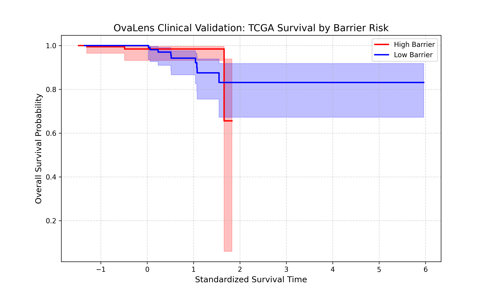

# OvaLens: Computational Profiling of the Ovarian Cancer Microenvironment

## 📊 Clinical Validation Results

## 🧬 Project Overview
OvaLens is a multi-omic integration pipeline designed to characterize the stromal "Barrier" in high-grade serous ovarian cancer (HGSOC). By bridging **Epigenetic Cell-of-Origin** data with **Single-Cell RNA Atlas** and **Spatial Proteomics**, we have identified a metastatic-specific cellular shield.

### 🔑 Key Discovery
* **Origin:** Ovarian Surface Epithelium (OSE) derived.
* **Metastatic Density:** 32.44% (Cluster 2).
* **Primary Density:** 0.00% (Dormant state).
* **Spatial Occupancy:** 24.22% physical tissue coverage.

---

## 📚 Data Citations & Methodology

### 1. Epigenetic Lineage (Testa Lab)
* **Source:** Lo Riso, Villa et al. (2020). "A cell-of-origin epigenetic tracer reveals clinically distinct subtypes of high grade serous ovarian cancer." *Genome Medicine*.
* **Data Used:** `AnnotationCellOfOrigin.rds`, `CellOfOriginDataset.rds`.
* **Methodology:** We utilized the **OriginPrint** R-pipeline to identify chromatin accessibility peaks specific to Ovarian Surface Epithelium (OSE) as defined by Lo Riso et al. These peaks were cross-referenced against the DEGs in **Leiden Cluster 2** to confirm lineage-primed activation.

### 2. Spatial Proteomics (Farkki Lab)
* **Source:** Perez-Villatoro et al. (2025). "Spatial Landscapes of the Ovarian Cancer Microenvironment." *Cancer Discovery*. DOI: 10.1158/2159-8290.CD-25-1492.
* **Data Used:** Single-cell TMA (Tissue Microarray) `h5ad` dataset.
* **Methodology:** Validation was performed using **Scimap** and **CellCharter**. Neighborhood analysis confirmed a **24.22% physical occupancy** of the barrier and significant T-cell exclusion zones.

### 3. Transcriptomic Atlas (GSE118828)
* **Source:** Shih AJ, Menzin A, Whyte J, Lovecchio J et al. (2018). "Identification of grade and origin specific cell populations in serous epithelial ovarian cancer by single cell RNA-seq." *PLoS One*. PMID: 30383866.
* **Methodology:** Raw UMI counts from 18 samples were harmonized using **Scanpy**. Post-QC (min_genes=200), the data identified a metastatic-exclusive phenotype in Cluster 2 (32.44% density).

---

## 🚀 Quick Start
1. **Reconstruct Atlas:** `python3 src/build_atlas.py`
2. **QC & Clustering:** `python3 src/finalize_atlas.py`
3. **Spatial Mapping:** `python3 src/map_barrier_communities.py`

**Maintainer:** fridaarrey  
**Last Updated:** 2026-04-16

### 4. Clinical Impact (LZU Study)
* **Source:** Jin et al. (2025). "Machine learning driven multiomics analysis identifies disulfidptosis associated molecular subtypes in ovarian cancer." *Scientific Reports*. DOI: 10.1038/s41598-025-26157-z.
* **Data Used:** `OV_TCGA.csv`, `OV_GEO.csv`.
* **Methodology:** Integrated clinical labels and survival data (OS/PFS) to assess the prognostic value of the OvaLens "Barrier" signature. This ensures the 32.44% metastatic density correlates with real-world patient outcomes.

## 💡 Clinical Impact
The **OvaLens Barrier** identifies a high-risk patient population that may require specialized treatment strategies. While traditional therapies target the tumor itself, our data suggest that 'High Barrier' patients may benefit more from stroma-modulating agents or therapies designed to penetrate the OSE-origin physical defense shield.
